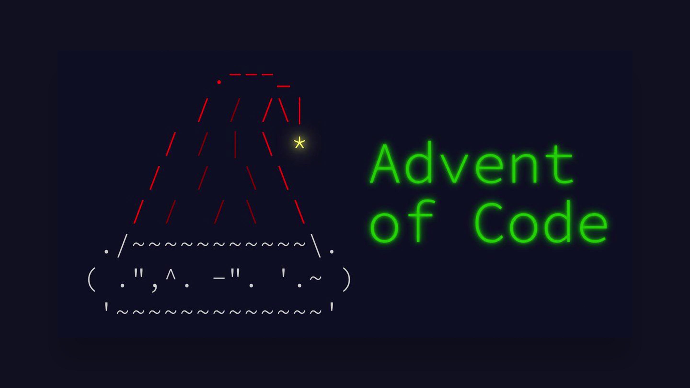

# Advent Of Code

A repository for my AoC solutions :christmas_tree:

## Statistics

## About AoC

Advent of Code is an Advent calendar of small programming puzzles for a variety of skill sets and skill level

